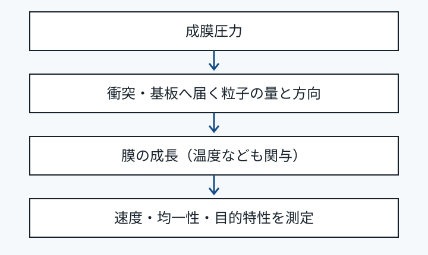

## 1. 問いと到達目標

「圧力を下げれば、よい膜になるのか」。この問いには、何を膜質と呼ぶかを決めてから答える必要がある。成膜速度、面内の膜厚均一性、密度、残留応力、密着性は別々の評価軸である。

この教材では、次のことを説明できるようになる。

- 成膜前の到達圧力と、ガスを導入した成膜中の圧力を区別する。
- 圧力、衝突、粒子輸送の関係を言葉と簡単な比で説明する。
- 成膜速度の変化だけから膜質を断定できない理由を説明する。
- 圧力の影響を調べる比較実験で、記録する条件と測定項目を選ぶ。

前提知識は、気体の圧力、原子、薄膜という言葉の意味である。主に不活性ガスを用いるスパッタ成膜の粒子輸送を扱う。反応性ガスによる化学反応や装置固有のレシピは扱わない。

## 2. 圧力を二つに分ける

スパッタリングは、イオンの衝突でターゲットから材料を放出させ、基板上に堆積させる方法である。ターゲットは膜の材料源、基板は膜を形成する土台を指す。一般的なマグネトロンスパッタでは、排気後にアルゴンなどのガスを導入して放電を維持する。[出典1](https://www.lesker.com/newweb/faqs/question.cfm?id=163)

| 用語 | いつの圧力か | 確認したいこと |
| --- | --- | --- |
| 到達圧力・ベース圧力 | プロセスガス導入前 | 残留ガスや排気状態 |
| 成膜圧力・プロセス圧力 | ガス導入・放電中 | 粒子輸送と放電の条件 |

ベース圧力を低くする目的と、成膜圧力を下げる目的は同じではない。残留気体の混入を抑える観点と、放電中の輸送を変える観点を混同しない。[出典2](https://www.lesker.com/newweb/faqs/question.cfm?id=494)

## 3. 圧力から粒子輸送へ

**平均自由行程**とは、粒子が衝突するまでに進む距離の平均である。希薄気体で温度と衝突断面積を一定とみなす近似では、圧力が高いほど気体の数密度が大きくなり、平均自由行程は短くなる。[出典2](https://www.lesker.com/newweb/faqs/question.cfm?id=494)

この関係だけを取り出すと、次の比で表せる。

```text
λ₂ / λ₁ ≈ p₁ / p₂
```

λ は平均自由行程（m）、p は圧力（Pa）、添字1と2は比較する二つの条件を表す。温度、気体種、衝突の性質が大きく変わる場合、この単純な比例だけでは足りない。高速のスパッタ粒子と背景気体の衝突を、熱平衡の気体分子同士と同じ数値で扱うことも避ける。

説明用の仮定として、条件1で λ₁ = 40 mm、p₁ = 0.5 Pa と置く。条件2で p₂ = 1.0 Pa にすると、同じ近似のもとでは λ₂ = 40 × 0.5 / 1.0 = 20 mm となる。これは実測値やアルゴンの推奨条件ではない。



図の読み方：圧力の変更は衝突機会を変え、基板へ届く粒子の量や方向に影響し得る。膜の成長には、基板温度などの別の条件も関わる。最後は速度・均一性・目的特性を測って判断する。

## 4. 速度と膜質を分けて考える

メーカーの技術ガイドでは、成膜圧力の低下による衝突の減少が成膜速度の向上につながる場合を説明している。一方、粒子の散乱は膜厚分布にも関わり、距離や配置を変えると速度と均一性の両方が変わる。[出典3](https://www.lesker.com/newweb/ped/rateuniformity.cfm)

| 観察 | 言えること | それだけでは言えないこと |
| --- | --- | --- |
| 同じ時間で膜が厚くなった | 平均的な堆積速度が増えた | 密着性や耐久性が改善した |
| 中央と端の膜厚差が変わった | 面内分布が変わった | 膜の密度が一様になった |
| 圧力変更後に試料が反った | 反りが条件変更と同時に変化した | 圧力だけが原因である |

最後の行は、因果関係を区別するための教材上の例である。膜厚、温度履歴、材料の組合せなどが同時に変わっていないかを確かめる必要がある。**「膜質がよい」を、測定できる目的特性へ言い換える**ことが出発点になる。

## 5. 比較実験を組み立てる

以下は公開資料の輸送の考え方から組み立てた、一般的な学習用の実験設計案である。装置の運転手順や推奨設定値ではない。

1. 目的を決める。例えば「膜厚均一性を保ったまま成膜速度を変えられるか」とする。
2. 変更する量を成膜圧力とし、ターゲット、基板、幾何配置、電力設定、温度条件を可能な限り揃える。
3. 電圧・電流、実際の基板温度、ガス流量、成膜時間も記録する。設定を固定しても、実際の放電状態が同じとは限らない。
4. 同一時間での膜厚から速度を比べる。目的特性の比較では膜厚の違いを交絡要因として扱い、必要なら膜厚を揃えた別の比較を行う。
5. 中央と端など同じ位置で膜厚を測り、繰返し測定でばらつきを確認する。

競合仮説として「衝突が減ったため輸送が変わった」と「放電状態や温度が変わったため堆積が変わった」を並べる。速度だけで両者を識別せず、記録した電気条件や温度、膜厚分布も照合する。

## 6. 適用限界

- この教材の比の計算は、温度や衝突断面積を一定とする概算である。
- 放電を維持できる範囲や安全な運転条件は装置ごとに異なる。低圧化を無条件に進める根拠にはしない。
- 化合物膜、反応性スパッタ、基板バイアス、強いイオン照射を含む系では、化学反応や入射エネルギーを含めた説明が必要になる。
- 応力の符号や屈曲寿命を圧力だけから予測するモデルは、この教材では提供しない。

## 7. 確認問題

1. ベース圧力と成膜圧力を、測るタイミングで区別してください。
2. 同じ温度・衝突の性質を仮定して圧力を3倍にすると、平均自由行程の比はどうなりますか。
3. 同一時間の成膜で膜厚が増えました。「密着性が改善した」と結論してよいですか。
4. 圧力を変更した比較で、基板温度も変わっていました。どのような追加確認が必要ですか。
5. 速度と均一性を比較するため、最低限どのような膜厚データを取りますか。

### 解答と理由

1. ベース圧力はガス導入前、成膜圧力はプロセスガス導入・成膜中の圧力である。目的が異なるので区別する。第2章を参照。
2. 約1/3になる。λ₂ / λ₁ ≈ p₁ / p₂ に p₂ = 3p₁ を代入する。第3章を参照。
3. 結論できない。確認したのは平均的な成膜速度の変化であり、密着性は別に測る。第4章を参照。
4. 温度条件を揃えた比較、または温度の影響を分けて評価する実験を追加する。電気条件などの同時変化も調べる。第5章を参照。
5. 成膜時間と、中央・端など対応する位置の膜厚を記録する。繰返し測定でばらつきも見る。速度は膜厚を時間で割って求める。第5章を参照。

## 8. 30秒復習と次の学習

圧力は、粒子が基板へ届くまでの衝突に関わる。衝突は速度や分布に影響するが、速度の改善は膜質全体の改善を意味しない。目的特性を定義し、同時に変わった条件を記録して比較する。

次は、基板温度と表面での原子の移動、膜厚と応力測定、反応性ガスの役割をそれぞれ学ぶと、輸送から膜の成長へ議論を広げられる。

## 9. 出典と範囲

- [1. Kurt J. Lesker Company：What is sputtering?](https://www.lesker.com/newweb/faqs/question.cfm?id=163) — スパッタ成膜とプロセスガスの基本。
- [2. Kurt J. Lesker Company：Why is a low base pressure critical?](https://www.lesker.com/newweb/faqs/question.cfm?id=494) — 残留気体と平均自由行程の説明。蒸着を扱う資料なので、スパッタの膜質へそのまま一般化していない。
- [3. Kurt J. Lesker Company：Magnetron Performance Optimization Guide](https://www.lesker.com/newweb/ped/rateuniformity.cfm) — 圧力、距離、速度、均一性の関係。

参照確認日：2026-09-19。図、比較の整理、例題、実験設計案は本教材の説明用に作成した。会社固有のデータ、条件表、未公開資料は使用していない。
